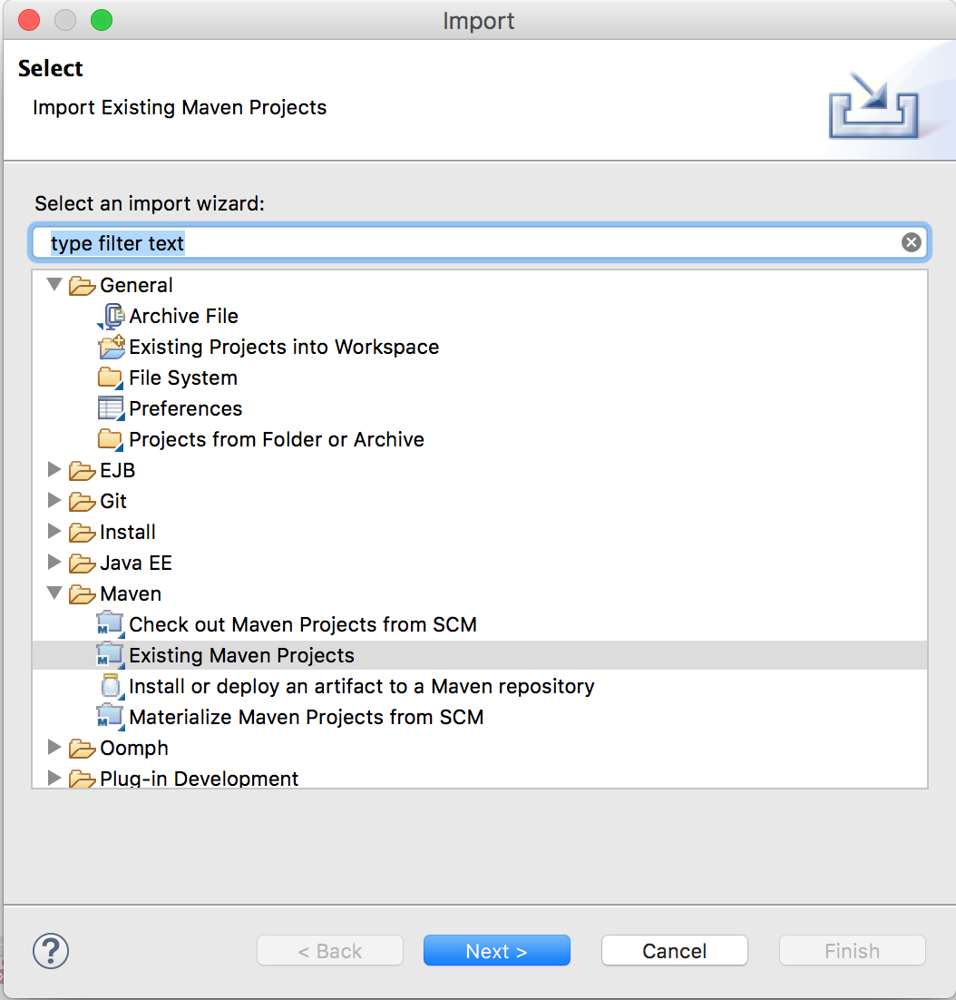

# Create and deploy an Hello world web application using Maven and Tomcat

To create a standard empty java webapp project structure it is possible to use maven and in particular the `maven-archetype-webapp` archetype.

```bash 
mvn archetype:generate -DgroupId=com.hello.world -DartifactId=hello-world -DarchetypeArtifactId=maven-archetype-webapp -DinteractiveMode=false
```
Depending on your network it could take sometime. After that you should have a new folder with the same name of the artifactId and containing a folder structure like this
```txt
hello-world/
├── pom.xml
└── src
    └── main
        ├── resources
        └── webapp
            ├── WEB-INF
            │   └── web.xml
            └── index.jsp
```
At this point you can use maven stage to compile and produce a distribution package with the command `mvn clean package` and if everithing goings well your folder structure will be like below. As you can see the package stage has produced a WAR file.
```
hello-world/
├── pom.xml
├── src
│   └── main
│       ├── resources
│       └── webapp
│           ├── WEB-INF
│           │   └── web.xml
│           └── index.jsp
└── target
    ├── classes
    ├── hello-world
    │   ├── META-INF
    │   ├── WEB-INF
    │   │   ├── classes
    │   │   └── web.xml
    │   └── index.jsp
    ├── hello-world.war
    └── maven-archiver
        └── pom.properties
```
Now you can copy the WAR file inside your Tomcat `webapp` folder and run tomcat with the command `catalina.sh run` from Tomcat `bin` folder. 
During server startup you should be able to see tomcat deploying your application:
```log
15-Jan-2018 16:13:20.817 INFORMAZIONI [main] org.apache.catalina.startup.Catalina.load Initialization processed in 598 ms
15-Jan-2018 16:13:20.851 INFORMAZIONI [main] org.apache.catalina.core.StandardService.startInternal Starting service [Catalina]
15-Jan-2018 16:13:20.851 INFORMAZIONI [main] org.apache.catalina.core.StandardEngine.startInternal Starting Servlet Engine: Apache Tomcat/8.5.24
15-Jan-2018 16:13:20.874 INFORMAZIONI [localhost-startStop-1] org.apache.catalina.startup.HostConfig.deployWAR Deploying web application archive [/usr/local/apache-tomcat-8.5.24/webapps/hello-world.war]
15-Jan-2018 16:13:21.204 INFORMAZIONI [localhost-startStop-1] org.apache.catalina.startup.HostConfig.deployWAR Deployment of web application archive [/usr/local/apache-tomcat-8.5.24/webapps/hello-world.war] has finished in [329] ms
15-Jan-2018 16:13:21.543 INFORMAZIONI [main] org.apache.coyote.AbstractProtocol.start Starting ProtocolHandler ["http-nio-8080"]
15-Jan-2018 16:13:21.549 INFORMAZIONI [main] org.apache.coyote.AbstractProtocol.start Starting ProtocolHandler ["ajp-nio-8009"]
15-Jan-2018 16:13:21.551 INFORMAZIONI [main] org.apache.catalina.startup.Catalina.start Server startup in 733 ms
```

If Tomcat is started up without any issue you should be able to reach your hello world app index page at http://localhost:8080/hello-world/.

The same result could be reached also using Postman creating a new GET request with result type HTML or Auto. 


If you want you can open the project just created also with your IDE, for example if you are using Eclipse, STS or IntelliJ IDEA you can easily import using maven support functionality.


