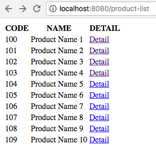
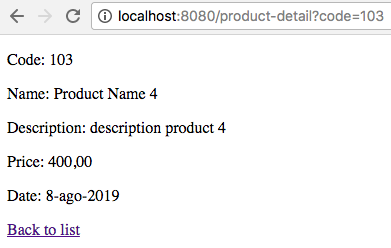

# Learn how to implement a simple web application using JEE features

Download [backend-course_day3.zip](backend-course_day3.zip) file and import into your IDE as maven project.

the structure of the project is 
```txt
├── src
│   └── main
│       ├── java
│       │   └── com
│       │       └── mcs
│       │           └── be
│       │               └── course
│       │                   ├── Main.java
│       │                   ├── productinventory
│       │                   │   ├── Inventory.java
│       │                   │   └── Product.java
│       │                   └── servlets
│       │                       ├── HelloServlet.java
│       │                       ├── ProductDetailServlet.java
│       │                       └── ProductListServlet.java
│       └── webapp
│           ├── index.jsp
│           ├── productDetail.jsp
│           └── productList.jsp

```

The project has a configuration that enable the use of an embedded tomcat, so you can run the project using your IDE.
To run the application launch as a main method inside `Main.java class`. 

Once started you can try the sequent urls:
- http://localhost:8080/
- http://localhost:8080/hello
- http://localhost:8080/hello?key=Matteo


GOAL: Implement everything necessary to see a product list and a product detail page like following.





You can use all libraries you want to help in your development adding them to maven dependencies. 


HINT:
- check the TODO inside JSPs and servlets
- remember the difference between forward and sendRedirect
- use tags instead of scriptlet
- if you complete the exercise try to add also Filter and Listener


Solution: [backend-course_day3_examplesolution.zip](backend-course_day3_examplesolution.zip).


REMINDER
Java EE web components are:
- Java Servlets: used to handling requests
- Filters and Listeners: used to modify request lifecycle or to react to container events 
- Java Server Pages (JSP): used for presentation. 
- Deployment descriptor: configuration file to tell the container how to deploy components.
- Java Beans: used as value object for JSP 

Referring the MVC architectural pattern:
- Model -->  Java Bean
- View  -->  JSP
- Controller --> Servlet

The RequestDispatcher is a class that allows for "including" content in a request/response or "forwarding" a request/response to a resource
As a typical example, a servlet can use a RequestDispatcher to include or forward a request/response to a JSP 


Code Snippet:
```java
// retrieve request dispatcher
RequestDispatcher rd = getServletContext().getRequestDispatcher("/dispatchTo");

//or if you have access to request object

RequestDispatcher rd = request.getRequestDispatcher("/dispatchTo");

// forward
rd.forward(req,resp);

rd.include(req,resp);

resp.sendRedirect("/redirectTo");


// get/set parameter from request
req.setAttribute("KEY", value);
request.getAttribute("KEY");


```
