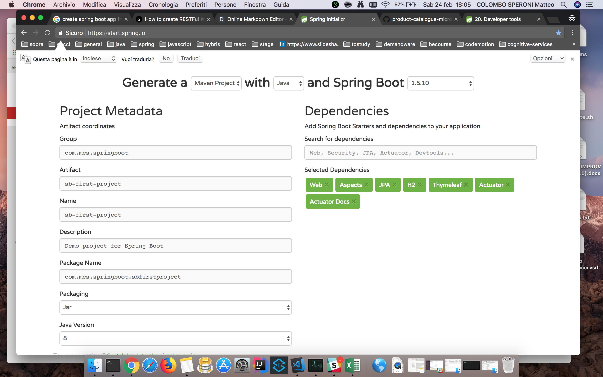
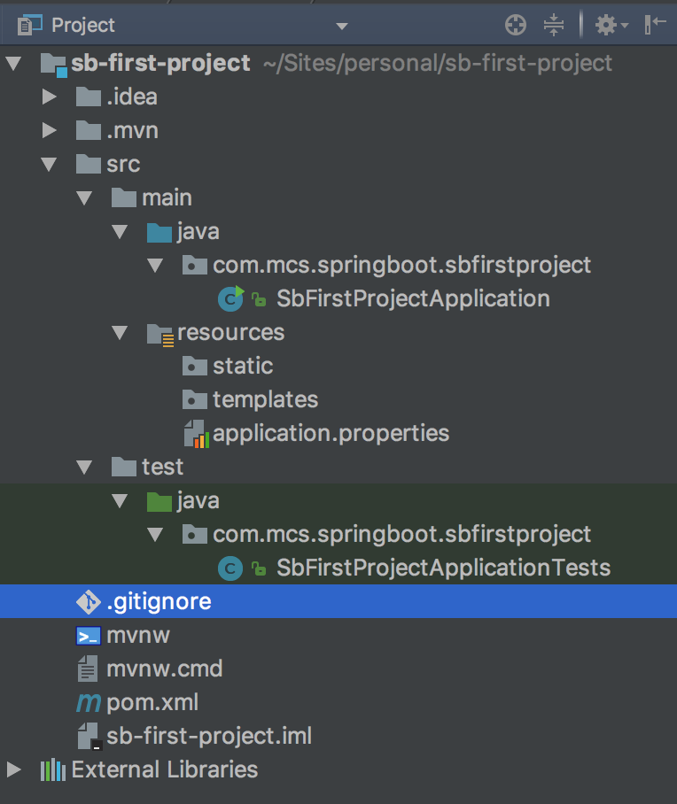
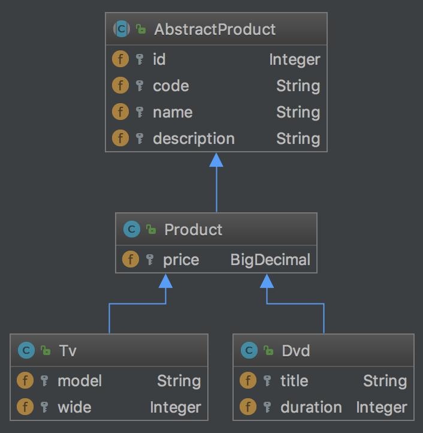
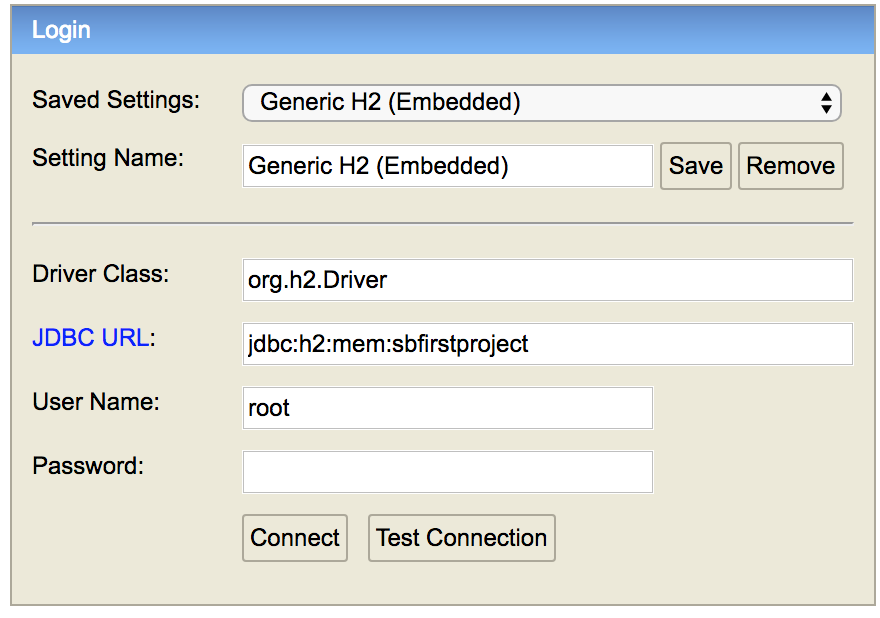
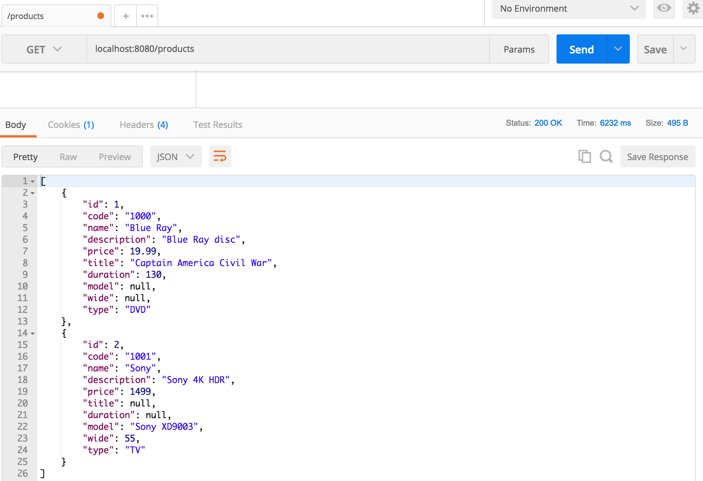

# Create a Spring Boot web application

Following this guide we will create in a few steps a complete web application based on Spring Boot. 
The best way of bootstrapping Spring Boot application is by using Spring Initializr.
Let’s first start by opening http//start.spring.io and click on "Switch to the full Version".

##### Steps :
- Select Maven Project
- If you want, change the Group/Package name. We will use `com.myfirstproject.springboot`
- Change the Artifact to `sb-first-project`, Name will automatically change to the same
- Leave the packaging to Jar and Java Version to 1.8
- Either type the Dependencies or select them below. We will add Web, Aspects, JPA, H2, Thymeleaf, Actuator, Actuator, Docs.
- Click on Generate Project button to download the zip file.
- Then open the project as a maven project inside your IDE.





### Domain Model
We start the project defining the domain model. We want to define a Product table that can contain Dvds and Televisions.

In an OO way of think we can draw this diagram as representation of our intent:


create `models` package and inside it the domain model classes:

Starting from this article you can read all JPA inheritance strategies and select the best one in each situation: https://www.thoughts-on-java.org/complete-guide-inheritance-strategies-jpa-hibernate/.
In our case we proceed with the `JOINED one`

AbstractProduct.java
```java
@MappedSuperclass
public abstract class AbstractProduct {

    @Id
    @GeneratedValue(strategy = GenerationType.IDENTITY)
    protected Integer id;

    @Column(nullable = false)
    protected String code;

    @Column
    protected String name;

    @Column
    protected String description;

    ...
}
```
Product.java
```java
@Entity
@Inheritance(strategy = InheritanceType.JOINED)
@Table(name = "PRODUCTS")
public class Product extends AbstractProduct {

    @Column
    protected BigDecimal price;
    ...
}
```
Dvd.java
```java
@Entity
@Table(name = "DVDS")
public class Dvd extends Product {

    @Column
    protected String title;

    @Column
    protected Integer duration;
    ...
}
```
Tv.java
```java
@Entity
@Table(name = "TELEVISIONS")
public class Tv extends Product {

    @Column
    protected String model;

    @Column
    protected Integer wide;
    ...
}
```

Configure H2 in memory database through application.properties:
```txt 
##### H2 SETTINGS
spring.datasource.url=jdbc:h2:mem:sbfirstproject;DB_CLOSE_DELAY=-1;DB_CLOSE_ON_EXIT=FALSE
spring.datasource.platform=h2
spring.datasource.username= root
spring.datasource.password=
spring.datasource.driverClassName = org.h2.Driver
spring.jpa.database=h2
spring.h2.console.enabled=true
spring.h2.console.path=/h2-console
spring.h2.console.settings.trace=false
spring.h2.console.settings.web-allow-others=false
```
Now create sample data for the application to be run at every startup:
```sql
--base
INSERT INTO PRODUCTS (id, code, name, description, price) VALUES (1, '1000', 'Blue Ray', 'Blue Ray disc', 19.99);
INSERT INTO PRODUCTS (id, code, name, description, price) VALUES (2, '1000', 'Blue Ray', 'Blue Ray disc', 19.99);

--dvd
INSERT INTO DVDS (id, title, duration) VALUES (1, 'Captain America Civil War', 130);

--tv
INSERT INTO TELEVISIONS (id, model, wide) VALUES (2, 'Sony XD9003', 55);
```

Start your application and test db connection try to connect with h2-console http://localhost:8080/h2-console/



After successful connection run the query below tocheck data inerted:
`select * from PRODUCTS as p join DVDS as d ON p.id=d.id;`

### Data Layer - Repository | DAO
Now we proceed creating DAO classes annotated as Spring Repository beans as access data layer; so create `daos` package and inside it the repository classes. 
Due to our domain model class structure we have to create more than one repository to handle concrete different implementation of product and also a generic one to create reusable queries. 

As you can see in this [article](http://jussi.hallila.com/2016/05/12/entity-inheritance-and-spring-data-jpa-daos.html)  and [spring documentation](https://docs.spring.io/spring-data/jpa/docs/1.11.10.RELEASE/reference/html/) we will proceed in this direction.

BaseProductDao.java
```java
@NoRepositoryBean //it is excluded from component scan so it will not become a bean
public interface BaseProductDao<EntityType> extends JpaRepository<EntityType,Integer>{
    
    @Query("select e from #{#entityName} e") // #{#entityName} will be magically replaced by type arguments in children
    List<EntityType> findThemAll();
    
}
```
ProductDao.java
```java
@Repository
public interface ProductDao<T extends Product> extends BaseProductDao<Product>{

}
```
DvdDao.java
```java
@Repository
public interface DvdDao extends ProductDao<Dvd> {

}
```
TvDao.java
```java
@Repository
public interface TvDao extends ProductDao<Tv> {

}
```

### Business Layer - Service
After repository layer we will start implementing our service (business) layer that is composed by_
- spring service beans
- facades
- mappings
- DTOs

We will start creating a `ProductService` interface and its implementation `ProductServiceImpl` inside a `services` package; in this service we will inject all our repositories.
Due to the fact all our repositories inherit from the same interface we need to qualify our injections using one of the solution explained in lesson 4.
We will also define and implement a new method to retrieve all products.

ProductService.java
```java
public interface ProductService {
    List<Product> retrieveAllProducts();
}
```
ProductServiceImpl.java
```java
@Service
public class ProductServiceImpl implements ProductService {

    @Autowired
    ProductDao<Product> productDao;

    @Autowired
    DvdDao dvdDao;

    @Autowired
    TvDao tvDao;

    @Override
    public List<Product> retrieveAllProducts() {
        return productDao.findThemAll();
    }

}

```

### Business Layer - Facade | Mapping | DTO
Now we create a facade, this is optional if we implement all the business layer inside a single service, especially in a simple application like this one. By the way, like we saw in the last lesson it is good practice.
We proceed creating a `ProductFacade` interface and its implementation `ProductFacadeImpl` inside a `facades` package; in this facade we will inject our product's service. Due to the fact there there isn't a facade dedicated annotation we will use the generic `@Component`

We will also define and implement a new method to retrieve all products and inside it the mapping between data model object and DTOs objects necessary to presentation layer.

To do that we need to create a plain object `ProductDto` inside a `dtos` package. Cause we want to use a simple plain object to represent all of our domain models we need a way to understand which kind of product the instance is representing.
We create also an enum `ProductType` with values `GENERIC, DVD, TV` to understand which product type belongs our instance.

ProductDto.java
```java
public class ProductDto {

    private Integer id;

    private String code;

    private String name;

    private String description;

    private BigDecimal price;

    private String title;

    private Integer duration;

    private String model;

    private Integer wide;

    private ProductType type;
...

}
``` 
ProductType.java
```java
public enum ProductType {

    TV,
    DVD,
    GENERIC

}
``` 
Before creating our facade we need a converter between out entities and dtos, we will use one of the libraries that can help us to configure these mappings [Orika Mapper](https://orika-mapper.github.io/orika-docs/intro.html).
To add the library to our project we need to add the dependency inside our pom.xml as suggest inside orika mapper documentation. For this project we will use the orika mapper starter provided by a japanese devoper instead of using core library [github repo](https://github.com/akihyro/orika-spring-boot-starter) copying the Dependency Informations inside `<dependencies>` tag of pom.xml.

pom.xml
```xml
<dependencies>

...

<dependency>
    <groupId>net.rakugakibox.spring.boot</groupId>
    <artifactId>orika-spring-boot-starter</artifactId>
    <version>1.6.0</version>
</dependency>

...
    
</dependencies>

```
 
ProductMapper.java
 ```java
@Component
public class ProductMapping implements OrikaMapperFactoryConfigurer {
    @Override
    public void configure(MapperFactory orikaMapperFactory) {
        orikaMapperFactory.classMap(Product.class, ProductDto.class)
                .byDefault()
                .mapNulls(false)
                .mapNullsInReverse(true)
                .register();

        orikaMapperFactory.classMap(Tv.class, ProductDto.class)
                .byDefault()
                .mapNulls(false)
                .mapNullsInReverse(true)
                .register();

        orikaMapperFactory.classMap(Dvd.class, ProductDto.class)
                .byDefault()
                .mapNulls(false)
                .mapNullsInReverse(true)
                .register();
    }
} 
```

Now that we have defined all of our code collaborators we can dedicate to our facade injecting our collaborators and implementing method described above.

ProductFacade.java
```java

public interface ProductFacade {
    
    List<ProductDto> retrieveAllProducts();
    
}

```

ProductFacadeImpl.java
```java
@Component
public class ProductFacadeImpl implements ProductFacade {

    @Autowired
    private MapperFacade mapperFacade;

    @Autowired
    private ProductService productService;


    @Override
    public List<ProductDto> retrieveAllProducts() {
        final List<Product> entities = productService.retrieveAllProducts();
        final List<ProductDto> dtos = entities.stream().map(a -> mapperFacade.map(a, ProductDto.class))
                .collect(Collectors.toList());
        return dtos;
    }
}
```

### Presentation Layer -  RestController
After business layer where we put our business logic we start implementing our presentation layer creating controllers and/or view to present data provided by facades.

We will start exposing a Rest endpoint creating a Rest Controller like we did last lesson. To do this we create a `ProductsRestController` class inside a controllers package injecting facade just created.

ProductsRestController.java
```java
@RestController("/products")
public class ProductsRestController {
    
    @Autowired
    ProductFacade productFacade;
    
    @GetMapping
    public List<ProductDto> getAllProducts() {
        return productFacade.retrieveAllProducts();
    }

}
```

Now can test our resource via Postman creating a new request to http://localhost:8080/products and should see a result like the one below.




### Presentation Layer -  MvcController
After exposing data with a rest controller we will create a view for list of products using JSP (then we will try also with Thymeleaf).
To do this we need to create a standard JEE structure expected from containers `webapp/WEB-INF` folder under `src/main`.

To use jstl inside JSPs we need to declare into our pom.xml dependencies a jstl implementation using the one defined into parent pom.

pom.xml
```xml
<dependency>
    <groupId>javax.servlet</groupId>
    <artifactId>jstl</artifactId>
</dependency>
```

In order to create a reusable "template" we will create a folder `tags` inside `WEB-INF` with a `master.tag` 

master.tag
```html
<jsp:directive.attribute name="title" required="true" rtexprvalue="true" />
<!DOCTYPE>
<html>
<head>
    <title>${title}</title>
    <meta charset="UTF-8">
    <meta name="description" content="First Project Content">
</head>
<body>
<div>
    <div class="container">
        <jsp:doBody />
    </div>
</div>
</body>
```

Using this tag as main template we can create a productList page inside a folder `views` under `WEB-INF`

productList.jsp
```html
<%@ taglib prefix="c" uri="http://java.sun.com/jsp/jstl/core" %>
<%@ taglib prefix="fn" uri="http://java.sun.com/jsp/jstl/functions" %>
<%@ taglib prefix="custom" tagdir="/WEB-INF/tags" %>

<custom:master title="product list">

    <table>
        <thead>
        <tr>
            <th>CODE</th>
            <th>NAME</th>
            <th>DETAIL</th>
        </tr>
        </thead>
        <tbody>
        <c:if test="${products != null}">
            <c:forEach items="${products}" var="p">
                <tr>
                    <td>${p.code}</td>
                    <td>${p.name}</td>
                    <td><a href="/product?code=${p.code}">Detail</a></td>
                </tr>
            </c:forEach>
        </c:if>
        </tbody>
    </table>

</custom:master>
```

After creation of the view we need to create a Controller and to configure a `ViewResolver` to let MVC know where to find views declared inside Controllers.
We can proceed adding a dedicated java configuration creating a package `configs` to collect this java config and others we will add in future in the same place.
After that we will create a class `MvcConfig` annotated as `@Configuration` and `@EnableWebMvc` that extends `WebMvcConfigurerAdapter` with a bean `internalResourceViewResolver`.

MvcConfig.java
```java
@Configuration
@EnableWebMvc
public class MvcConfig extends WebMvcConfigurerAdapter {

    @Bean
    public ViewResolver jspViewResolver() {
        InternalResourceViewResolver vr = new InternalResourceViewResolver();
        vr.setViewClass(JstlView.class);
        vr.setPrefix("/WEB-INF/views/");
        vr.setSuffix(".jsp");
        vr.setOrder(1);
        return vr;
    }

}

```

The last thing to do is to create an `ProductsMvcController` similar to previously created RestController that return a `ModelAndView` intead of `@ResponseBody`.

ProductsMvcController.java
```java
@Controller("/mvc")
public class ProductsMvcController {

    @Autowired
    ProductFacade productFacade;

    @GetMapping("/products")
    public ModelAndView getAllProducts() {
        
        List<ProductDto> products = productFacade.retrieveAllProducts();
        ModelAndView mav = new ModelAndView("productList");
        mav.addObject("products", products);
        
        return mav;
    }

}
```

This is not enough because the webapp folder is not considered when you startup the server. 
In fact, by default in the `spring-boot-starter-web` is included the `spring-boot-starter-tomcat` that includes the `tomcat-embed-core`; but we need also the `tomcat-embed-jasper` to enable embedded Tomcat uses the Jasper2 JSP Engine to implement JSP rendering.
Add following dependencies inside pom.xml

pom.xml
```xml
<dependency>
    <groupId>org.springframework.boot</groupId>
    <artifactId>spring-boot-starter-tomcat</artifactId>
    <scope>provided</scope>
</dependency>
<dependency>
    <groupId>org.apache.tomcat.embed</groupId>
    <artifactId>tomcat-embed-jasper</artifactId>
    <scope>provided</scope>
</dependency>
```

They are marked as `provided` cause it is not to be included in package in case of deploying solution in an external container.

Now you can launch your application and check the result of http://localhost:8080/mvc/products 

### OPTIONAL CONFIG
To make configuration of the project valid also in this case we need to change `packaging` type from `jar` to `war` 
and define the final name that maven need to put on the produced artifact with package stage.

Add final name inside `build` tag after `dependencies` tag

pom.xml
```xml
<finalName>backend-course</finalName>
```

After that we need to make our main class an extension of `SpringBootServletInitializer` in order to make use of Spring Framework’s Servlet 3.0 support and allows to configure the application when it’s launched by the servlet container, as explained in [spring documentation](https://docs.spring.io/spring-boot/docs/current/reference/html/howto-traditional-deployment.html)

SbFirstProjectApplication.java
```java
@SpringBootApplication
public class SbFirstProjectApplication extends SpringBootServletInitializer {

}

```
